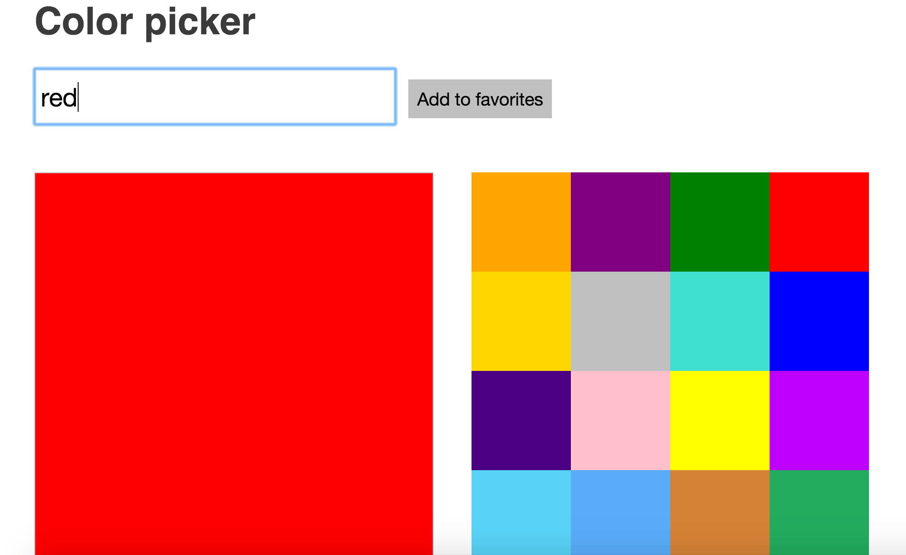

# Colour Picker
A colour picker written in Javascript and jQuery.

A colour is typed into the box and the preview box changes to that colour as well as the rgb code displaying below the box. When it is added to favourites, it appears as a block of colour.

This was from a Codebar tutorial in preperation for coaching there.

## Screenshots

  

